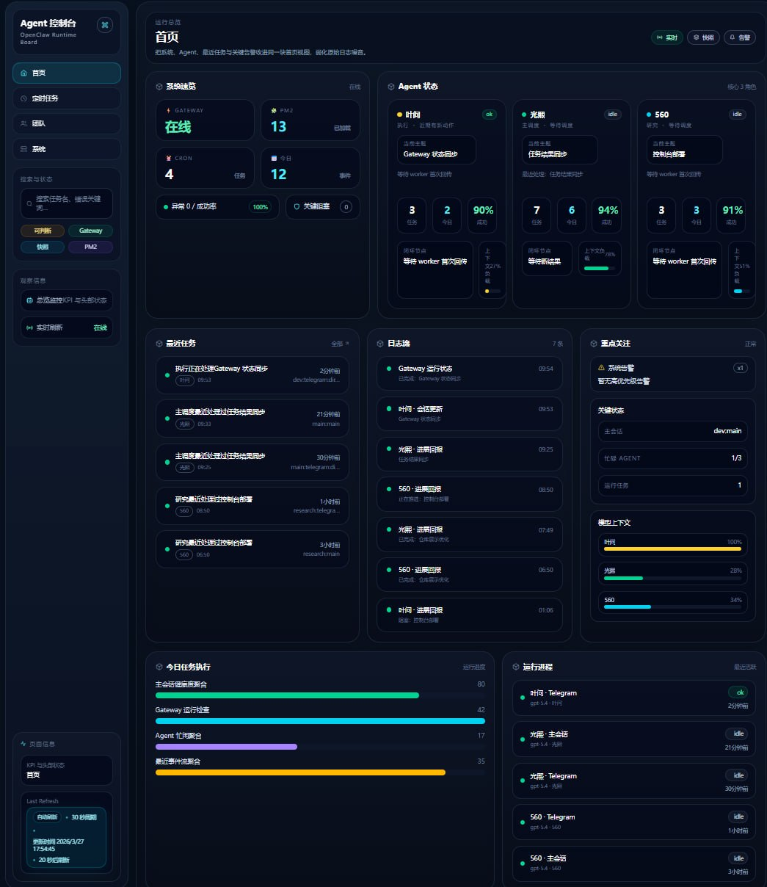
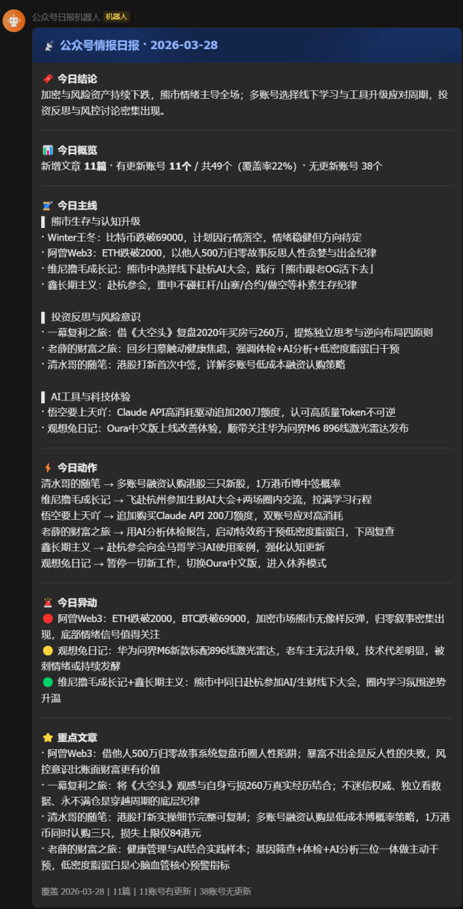

# Multi-Agent Workflow Showcase

AI workflow portfolio for **AI product / AI engineering / workflow automation / agent orchestration** roles.

> A sanitized public repository showing how I turned local AI tooling into a usable workflow system: deployment, multi-agent execution loops, monitoring workflows, and a console layer for visibility. Sensitive business data, private credentials, and production-only details are intentionally removed.

---

## Who I am

I build **practical AI workflow systems** rather than isolated demos.

This repository is meant to help a hiring manager, recruiter, or interviewer answer four questions quickly:

1. **What roles fit me?**  
   AI 产品 / AI 应用工程 / 自动化工作流 / Agent 编排 / 技术型 PM + builder
2. **What did I personally lead?**  
   Local OpenClaw deployment, workflow adaptation, multi-agent loop design, monitoring/digest workflow implementation, and dashboard-style presentation
3. **Where are the results?**  
   In the project walkthroughs, sanitized examples, architecture writeups, and portfolio-oriented summary docs in this repo
4. **Why is this interview-worthy?**  
   Because the work connects infrastructure → workflow → use case → visibility, instead of stopping at prompt experiments or single scripts

---

## Why this repository is worth reviewing

### 1. Clear candidate positioning
I am strongest in projects that require:
- turning AI capability into a repeatable workflow
- connecting tools, agents, and delivery loops
- making complex systems easier to operate and explain
- pushing a prototype toward something closer to a usable product

### 2. I led end-to-end workflow design
My role was not only “write a script” or “call an API”. I drove the project through multiple layers:
- **system setup**: local OpenClaw deployment and adaptation
- **workflow design**: multi-agent dispatch / execution / sync / follow-up loops
- **application implementation**: research monitoring and digest workflows
- **presentation**: an agent console / dashboard to make system state visible

### 3. The output is portfolio-readable
This repo is intentionally structured for hiring review:
- short README homepage
- role / impact summary
- metrics and scope summary
- demo walkthrough
- project and case documents for deeper review

---

## My role and impact

### What I personally drove
- set up and adapted a local OpenClaw-based AI operating environment
- designed the main-agent / sub-agent collaboration pattern
- built workflow logic around dispatch → execution → result sync → follow-up dispatch
- implemented monitoring / digest style workflows with reusable configuration ideas
- added a console/dashboard layer to improve observability and presentation

### What this shows
- I can move from technical setup to practical workflow execution
- I can frame AI work as a system, not just a collection of prompts
- I can connect backend execution with user-facing visibility
- I think about delivery, maintainability, and communication together

See:
- [`docs/my-role-and-impact.md`](docs/my-role-and-impact.md)
- [`docs/metrics-and-scope.md`](docs/metrics-and-scope.md)
- [`docs/demo-walkthrough.md`](docs/demo-walkthrough.md)

---

## Result signals

This repository demonstrates several concrete result signals relevant to hiring:

- **From tooling to system**: not only using AI tools, but shaping them into a repeatable execution environment
- **From single-agent to multi-agent**: introducing role separation and collaboration loops
- **From raw output to usable workflow**: monitoring, digesting, and structured delivery instead of one-off generation
- **From backend logic to product surface**: adding a console/dashboard to improve visibility and explainability
- **From personal experimentation to portfolio packaging**: sanitizing, organizing, and documenting the work for external review
- **From one-off reading to scheduled intelligence delivery**: packaging a daily content pipeline with config templates, deployment examples, and GitHub-safe artifacts

---

## Evidence gallery

These snapshots make the portfolio more concrete at a glance:

| Evidence | What it shows |
| --- | --- |
|  | **Agent Console / Dashboard** — a presentation layer for workflow observability, status visibility, logs, and execution summaries. |
|  | **mparticle Daily Intelligence Pipeline** — a scheduled digest delivery workflow with structured highlights, summary, and action items. |
|  | **Community / Research Monitoring** — a monitoring-and-digest surface for recurring discussion tracking, ranking, announcements, and market/community signal summaries. |

Related pages:
- [`docs/projects/agent-console.md`](docs/projects/agent-console.md)
- [`docs/projects/mparticle-daily-intelligence.md`](docs/projects/mparticle-daily-intelligence.md)
- [`docs/projects/research-monitoring.md`](docs/projects/research-monitoring.md)
- [`docs/cases/agent-console-case.md`](docs/cases/agent-console-case.md)
- [`docs/cases/mparticle-daily-case.md`](docs/cases/mparticle-daily-case.md)
- [`docs/cases/research-monitoring-case.md`](docs/cases/research-monitoring-case.md)

## Best pages to read first

If you only spend 5–10 minutes on this repository, read in this order:

1. [`docs/my-role-and-impact.md`](docs/my-role-and-impact.md)
2. [`docs/metrics-and-scope.md`](docs/metrics-and-scope.md)
3. [`docs/demo-walkthrough.md`](docs/demo-walkthrough.md)
4. [`docs/projects/mparticle-daily-intelligence.md`](docs/projects/mparticle-daily-intelligence.md)
5. [`docs/cases/mparticle-daily-case.md`](docs/cases/mparticle-daily-case.md)
6. [`docs/resume/resume-summary.md`](docs/resume/resume-summary.md)

Then go deeper into:
- [`docs/projects/openclaw-system.md`](docs/projects/openclaw-system.md)
- [`docs/projects/multi-agent-workflow.md`](docs/projects/multi-agent-workflow.md)
- [`docs/projects/research-monitoring.md`](docs/projects/research-monitoring.md)
- [`docs/projects/mparticle-daily-intelligence.md`](docs/projects/mparticle-daily-intelligence.md)
- [`docs/projects/agent-console.md`](docs/projects/agent-console.md)

---

## Repository structure

```text
.
├── README.md
├── assets/
│   └── files-overview.png
├── docs/
│   ├── my-role-and-impact.md
│   ├── metrics-and-scope.md
│   ├── demo-walkthrough.md
│   ├── github-sanitization-notes.md
│   ├── cases/
│   ├── projects/
│   └── resume/
└── examples/
    ├── accounts.example.json
    ├── mparticle-daily/
    └── twitter_digest_sample.py
```

---

## Notes for recruiters / hiring managers

- This is a **sanitized portfolio repository**, not a full production dump
- The emphasis is on **ownership, system thinking, workflow design, and productization awareness**
- If you are hiring for AI application, workflow automation, agent systems, or technical product builder roles, this repo is designed to make that fit easy to evaluate

If useful, I can also walk through the project as:
- a product case
- a technical architecture discussion
- a workflow design discussion
- a “what I personally owned vs. what is omitted for privacy” discussion
