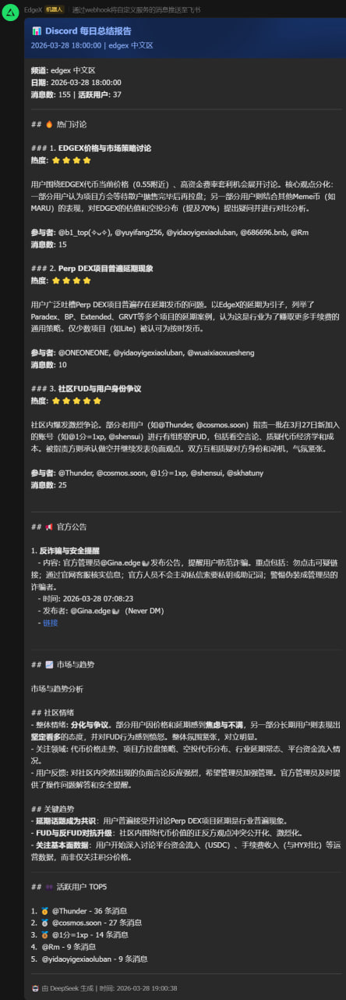

# Case: Research Monitoring System

## Problem
In fast-moving domains, information sources are scattered across multiple channels. Manual tracking does not scale well and makes consistent daily follow-up difficult.

## Visual proof

The screenshot shows one concrete operating surface of the system: a daily digest combining hot discussions, ranked topics, official announcements, market/community sentiment, and active-user summaries.

## Approach
The work was organized as an expandable monitoring system rather than a single-purpose script:
- tracked objects and sources handled through configuration
- repeated monitoring workflows designed around structured summaries
- monitoring treated as a reusable system layer

## What this case demonstrates
- system thinking
- workflow-based monitoring design
- abstraction from single script to reusable structure
- AI used for repeated execution support instead of chat-only interaction

## Why it matters
This case represents the transition from isolated automation to a more durable workflow asset.
